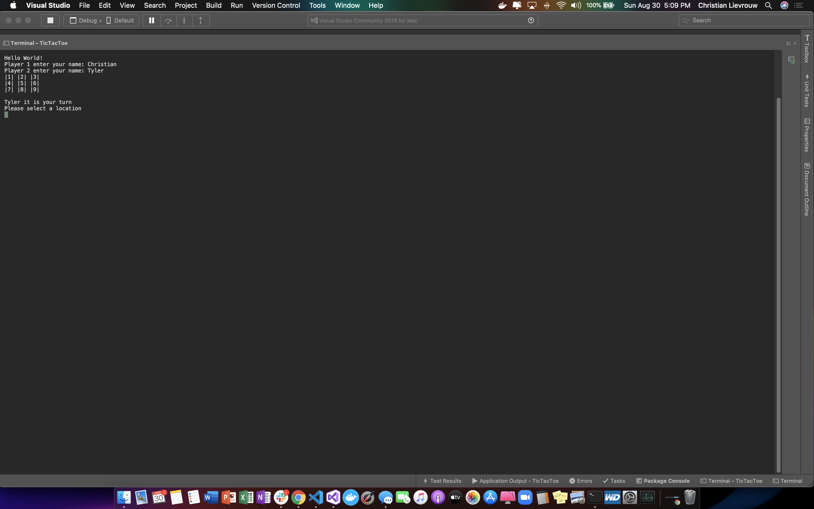

# labTicTacToe

1. The application is a TicTacToe game where users take turns placing a "X" or an "O" to try to get three in a row

2. 

3. Each player enters thier name
   Once the game has started you take turns placing an x or an o in board
   Once a player gets either 3 x's or o's in a row they win!!
